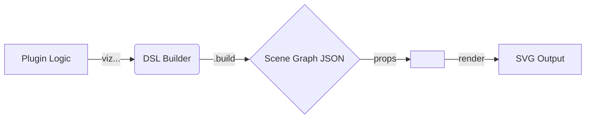

# Viz-Kit Architecture & DSL Guide

Viz-Kit separates the **description** of a diagram from its **rendering**. This allows plugins (like ANN or Decision Tree) to describe *what* to draw without worrying about *how* to draw SVG shapes, manage keys, or handle z-indexing.

## 1. The Big Picture

The data flow is linear:

1.  **Authoring**: You use the `viz()` DSL to describe your diagram.
2.  **Compilation**: Calling `.build()` compiles this description into a **Scene Graph** (a plain JSON object).
3.  **Rendering**: The `<VizCanvas />` component takes this Scene Graph and renders it as SVG.

## 2. The DSL (`viz()`)

The DSL uses the **Fluent Builder Pattern**. This means you chain methods together to build an object step-by-step.

### How it works internaly (`builder.ts`)

1.  **`VizBuilderImpl`**: This is the main orchestrator. It keeps:
    *   `_nodes`: A Map of all nodes by ID.
    *   `_edges`: A Map of all edges by ID.
    *   `_viewBox`: The dimensions of the canvas.

2.  **`node(id)`**: When you call this, the builder:
    *   Checks if a node with this `id` exists.
    *   If not, it creates a "draft" node object and stores it in the `_nodes` map.
    *   It returns a **`NodeBuilder`**, which is a special helper object focused ONLY on that specific node.

3.  **The Mutating Chain**:
    *   When you call `.circle(20)` on the `NodeBuilder`, it updates the "draft" node object inside the main builder's map.
    *   Crucially, `NodeBuilder` methods return `this` (the builder itself), allowing you to chain `.at().class().label()`.

4.  **Seamless Chaining**:
    *   To make the API feel "fluent", the `NodeBuilder` also implements `node()` and `edge()`.
    *   Calling `.node("B")` on node "A"'s builder simply forwards the call back to the main parent builder. This lets you jump from defining Node A straight to Node B without breaking the chain.

5.  **`.build()`**:
    *   This is the "commit" step.
    *   It converts the internal Maps into ordered Arrays (`nodes`, `edges`).
    *   It performs validation (e.g., checking if an edge points to a non-existent node).
    *   It returns the pure `VizScene` object.

## 3. The Renderer (`VizCanvas.tsx`)

The rendering is "dumb" (stateless). It receives the `VizScene` and simply maps data to SVG elements.

*   **Structure**: It creates SVG groups (`<g>`) for layers: Edges -> Nodes -> Labels. This ensures consistent Z-indexing (nodes always sit on top of edges).
*   **Styling**: It applies the classes you defined in the DSL (e.g., `.class("neuron")`) to the SVG groups. This allows your CSS (`main.scss`) to control the look and feel (colors, stroke widths, hover effects).
*   **Interaction**: Click handlers defined in the DSL are attached to the SVG elements here.

## 4. Why this approach?

*   **Decoupling**: The ANN plugin doesn't need to know about SVG `<line>` or `<circle>` tags. It just thinks in terms of "connections" and "neurons".
*   **Performance**: The Builder is fast (just manipulating JS objects). React only updates the DOM when the `scene` object changes.
*   **Consistency**: All diagrams share the same arrow markers, hit-area logic, and z-ordering. You fix a bug in `VizCanvas`, and it's fixed for every plugin.
